# FoodLens System Architecture

## System Design Architecture Diagram

```mermaid
graph TB
    subgraph "Client Layer"
        User[👤 Users<br/>Students & Organizers]
        Browser[🌐 Web Browser]
    end

    subgraph "Frontend Layer"
        Streamlit[📱 Streamlit App<br/>frontend/app.py]
        Tabs[📑 Application Tabs]
        Tab1[➕ Add Event]
        Tab2[🔍 Browse Events]
        Tab3[🤖 Food Predictor]
        Tab4[📧 Contact Us]
        Map[🗺️ Folium/Leaflet Map<br/>Interactive UCLA Map]
    end

    subgraph "Backend Layer"
        BackendAPI[🔧 Backend Services]
        EventsAPI[📅 Events API<br/>backend/events.py]
        SubscribersAPI[👥 Subscribers API<br/>backend/subscribers.py]
        SupabaseClient[🔐 Supabase Client<br/>backend/supabase_client.py]
    end

    subgraph "ML/AI Layer"
        Predictor[🧠 Food Surplus Predictor<br/>model/predictor.py]
        Model[🌳 Decision Tree Model<br/>scikit-learn]
        Explainability[📊 Explainability Engine<br/>model/explainability.py]
        Training[🎓 Model Training<br/>model/train_model.py]
        Dataset[📈 Synthetic Dataset<br/>model/generate_dataset.py]
    end

    subgraph "Data Layer - Supabase"
        Postgres[(🗄️ PostgreSQL Database)]
        EventsTable[(events<br/>- id, building, zone<br/>- event_type, diet<br/>- is_active, image_url)]
        SubscribersTable[(subscribers<br/>- email, zone<br/>- dietary_preferences)]
        FeedbackTable[(feedback<br/>- name, email<br/>- message)]
        Storage[📦 Supabase Storage<br/>event-images bucket]
    end

    subgraph "External Services"
        GoogleMaps[🗺️ Google Maps<br/>Deep Links]
        StreamlitCloud[☁️ Streamlit Cloud<br/>Deployment]
    end

    subgraph "Static Assets"
        MapAssets[🗺️ UCLA Map Assets<br/>public/UCLA_MAP.png]
        EventImages[🖼️ Local Event Images<br/>event_images/]
    end

    subgraph "Configuration & Secrets"
        EnvVars[⚙️ Environment Variables<br/>.env / Streamlit Secrets]
        ModelConfig[📋 Model Config<br/>predictor_config.json]
        TreeJSON[🌳 Tree JSON<br/>predictor_tree.json]
        ExplanationsJSON[📝 Explanations<br/>explanations.json]
    end

    %% User Flow
    User --> Browser
    Browser --> Streamlit
    Streamlit --> Tabs
    Tabs --> Tab1
    Tabs --> Tab2
    Tabs --> Tab3
    Tabs --> Tab4
    Tab2 --> Map

    %% Frontend to Backend
    Tab1 --> EventsAPI
    Tab2 --> EventsAPI
    Tab4 --> SubscribersAPI
    Tab3 --> Predictor
    Tab1 --> Storage

    %% Backend to Data Layer
    EventsAPI --> SupabaseClient
    SubscribersAPI --> SupabaseClient
    SupabaseClient --> Postgres
    Postgres --> EventsTable
    Postgres --> SubscribersTable
    Postgres --> FeedbackTable
    SupabaseClient --> Storage

    %% ML Model Flow
    Predictor --> Model
    Predictor --> ModelConfig
    Model --> TreeJSON
    Model --> Explainability
    Explainability --> ExplanationsJSON
    Training --> Model
    Dataset --> Training
    Predictor --> Dataset

    %% External Integrations
    Map --> GoogleMaps
    Streamlit --> StreamlitCloud
    Streamlit --> EnvVars

    %% Static Assets
    Map --> MapAssets
    EventsAPI --> EventImages
    EventsAPI --> Storage

    %% Configuration
    SupabaseClient --> EnvVars
    Predictor --> ModelConfig
    
```

## Architecture Components

### 1. Client Layer
- **Users**: Students and event organizers accessing the platform
- **Web Browser**: Standard web browser interface

### 2. Frontend Layer
- **Streamlit Application** (`frontend/app.py`): Single-page application with tabbed interface
  - **Add Event Tab**: Form for organizers to post surplus food events
  - **Browse Events Tab**: Interactive map and event cards for students
  - **Food Predictor Tab**: ML-powered attendance prediction tool
  - **Contact Us Tab**: Feedback and subscription management
- **Folium/Leaflet Map**: Interactive UCLA campus map with event markers

### 3. Backend Layer
- **Supabase Client** (`backend/supabase_client.py`): Centralized database connection manager
  - Handles authentication via environment variables or Streamlit secrets
  - Provides reusable client instance
- **Events API** (`backend/events.py`): CRUD operations for events
  - `fetch_events()`: Retrieve active events
  - `add_event()`: Create new event
  - `deactivate_event()`: Close/archive events
- **Subscribers API** (`backend/subscribers.py`): User preference management
  - Email subscription handling
  - Dietary preference tracking

### 4. ML/AI Layer
- **Attendance Predictor** (`model/predictor.py`): Core prediction engine
  - Uses scikit-learn DecisionTreeRegressor
  - Provides interpretable recommendations
  - Generates human-readable explanations
- **Model Training** (`model/train_model.py`): Model training pipeline
  - Trains decision tree on historical data
  - Exports model artifacts (JSON, config)
- **Dataset Generation** (`model/generate_dataset.py`): Synthetic data creation
  - Generates training data from past events
- **Explainability Engine** (`model/explainability.py`): Model interpretation
  - Generates explanation traces
  - Exports explanations as JSON

### 5. Data Layer (Supabase)
- **PostgreSQL Database**: Primary data store
  - `events` table: Event metadata, locations, status
  - `subscribers` table: User preferences and notifications
  - `feedback` table: Contact form submissions
- **Supabase Storage**: File storage service
  - `event-images` bucket: Public image storage for event photos

### 6. External Services
- **Google Maps**: Deep linking for navigation
- **Streamlit Cloud**: Hosting and deployment platform

### 7. Static Assets
- **UCLA Map Assets**: Campus map images for Folium overlay
- **Local Event Images**: Fallback storage for development

### 8. Configuration
- **Environment Variables**: Supabase credentials (`.env` or Streamlit secrets)
- **Model Configuration**: Predictor parameters (`predictor_config.json`)
- **Model Artifacts**: Trained model exports (`predictor_tree.json`, `explanations.json`)

## Data Flow

### Event Creation Flow
1. User fills form in "Add Event" tab
2. Image uploaded to Supabase Storage
3. Event data sent to Events API
4. Events API writes to `events` table via Supabase Client
5. Event appears in "Browse Events" tab

### Event Browsing Flow
1. User opens "Browse Events" tab
2. Events API fetches active events from database
3. Events displayed as cards and map markers
4. User clicks event → Google Maps deep link opens

### Prediction Flow
1. Organizer inputs event details in "Food Predictor" tab
2. Predictor loads trained model and historical data
3. Model generates attendance prediction
4. Explanation engine provides interpretable reasoning
5. Recommendation displayed with explanation trace

### Subscription Flow
1. User submits preferences in "Contact Us" tab
2. Subscribers API writes to `subscribers` table
3. Preferences stored for future notifications

## Key Design Principles

1. **Separation of Concerns**: Frontend, backend, and ML layers are clearly separated
2. **Centralized Configuration**: Supabase client handles all database connections
3. **Interpretable AI**: Model decisions are transparent and explainable
4. **Ethical Design**: Opt-in subscriptions, no tracking, accessible UI
5. **Scalability**: Supabase provides managed database and storage
6. **Reproducibility**: Model artifacts and training data are versioned

## Technology Stack

- **Frontend**: Streamlit, Folium, Leaflet.js
- **Backend**: Python, Supabase Python SDK
- **Database**: PostgreSQL (via Supabase)
- **Storage**: Supabase Storage
- **ML Framework**: scikit-learn, pandas
- **Deployment**: Streamlit Cloud
- **Mapping**: Folium, Google Maps integration

